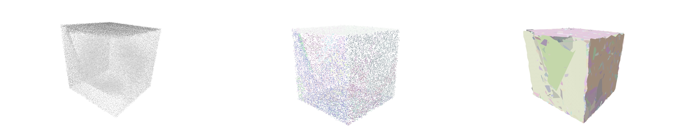
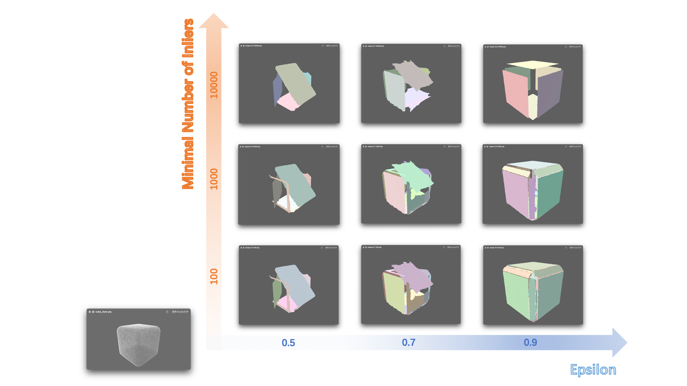
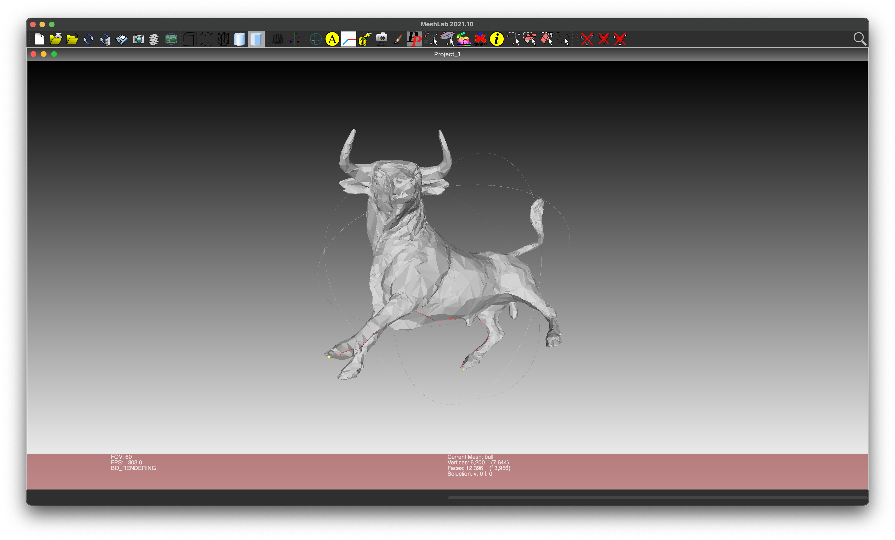

# 3D_VISION_ASSIGNMENTS
Some Cmake projects during first year of postgraduate

## Assignment_1_CGAL_Result:

## Assignment_2_Cloud_SegmentationOriginal:

## Assignment_2_Cloud_SegmentationResults:

## Assignment_2 Analysis:

## Assignment_3 Example:

